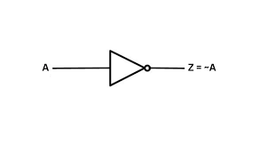

# NOT Gate

In this repository, I am designing and analyzing a CMOS Inverter / NOT Gate using the SkyWater PDK 130nm Technology. 

The design is created using 
<a href="https://xschem.sourceforge.io/stefan/index.html" target="_blank">xschem</a>, 
and its parameters(plots) are obtained through pre-layout simulations using 
<a href="https://ngspice.sourceforge.io/" target="_blank">ngspice</a>.

For the layout design, I am utilizing the 
<a href="http://opencircuitdesign.com/magic/" target="_blank">Magic VLSI Layout Tool</a>, 
a widely used open-source tool for IC design.

## Abstract 

This repository deals with the design and implementation of CMOS Inverter using SkyWater 130nm CMOS technology.
A NOT Gate, also known as an Inverter, is a fundamental digital logic gate that produces an output opposite to its input. It operates based on the principle of logical negation in Boolean algebra.

Function
If the input is HIGH (logic 1), the output is LOW (logic 0).
If the input is LOW (logic 0), the output is HIGH (logic 1).

TRUTH TABLE
  
| INPUT | OUTPUT |
|:--:|:--:|
|0|1|
|1|0|

    
**Symbol of not gate**

    
  

    

## Circuit Diagram 

   

## XOR Parameters 

|Parameter | Description |	Min |	Average |	Max |	Unit |	Condition |
|:--------:|:------------:|:----:|:---:|:-----:|:----:|:---------:|
| Technology Used | Skywater 130nm | - |  -   |  -  | - | - |
| VCC | Supply Voltage | - | 5.00 | - | V | T=-40C to 125C |
| tpHL | **Propagation Delay High to Low**: Delay from input 50% rise to output 50% fall (high-to-low transition) | -58.50| -61.65 | -63.64 | ps | T=-40C to 125C |
| tpLH | **Propagation Delay Low to High**: Delay from input 50% fall to output 50% rise (low-to-high transition) | 216.87 | 224.37 | 236.40 | ps | T=-40C to 125C |
| tr | **Rise time**: time taken for the output to go from 10% (0.5V) to 90% (4.5V) of its final high value | 289.90 | 305.95 | 329.12 | ps | T=-40C to 125C |
| tf | **Fall Time**: Time taken for the output signal to drop from 90% (4.5V) of its high level (VCC) to 10% (0.5V) of its high level| 217.40 | 235.97 | 260.87 | ps | T=-40C to 125C |
| Vth | **Threshold Voltage**: The threshold voltage of a MOSFET is the minimum gate-to-source voltage(Vgs) required to create a conducting path between the source and drain terminals | 0.4 | 0.7 | - | V | T=-40C to 125C |
| Cin | **Input Capacitance**: Capacitance seen at each input (A & B) of the XOR gate | - | - | - | - | - |
| Voh | Output high voltage | 4.919 | 5.000 | 5.089 | V | A != B at T=-40C to 125C |
| Vol | Output low voltage | -0.041 | 0.000 | 0.001 | V | A = B at T=-40C to 125C |

   
 

